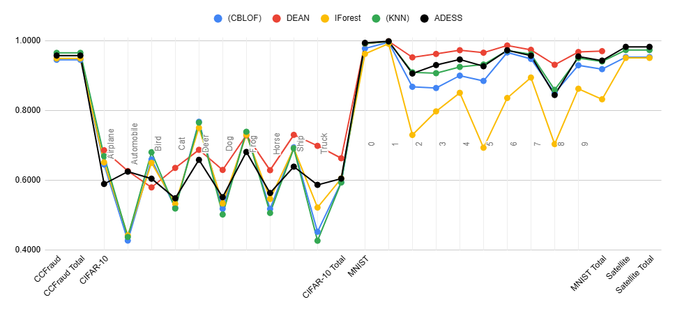

# Introduction
This algorithm is developed as part of my master's thesis: <a href="Master Thesis with affidavit.pdf">Anomaly Detection Using an Ensemble with Simple Sub-models, 2024</a>.
The algorithm explores the effectiveness of an ensemble of simple sub-models like linear regression in detecting anomalies.

# Results from the thesis experiments
The AUROCs of the runs reported in the thesis are stored in this <a href="https://docs.google.com/spreadsheets/d/1lLax3dy0JjQOxW_wwGM35UwRHdO8CJlR9QSlvxNbVNc/edit?usp=sharing">Google Sheet</a>

# Benchmarking


# Installation
Install the package using pip.
```
pip install adess==1.0.0
```


# Parameters
Run with --help to see the parameters
```
adess --help
```
```
usage: adess [-h] --train TRAIN --test TEST [--feat_sel_percent FEAT_SEL_PERCENT] [--max_feats MAX_FEATS] [--order ORDER] [--computation_budget COMPUTATION_BUDGET] [--no_submodels NO_SUBMODELS] [--prep PREP] [--extract EXTRACT]
             [--submodel SUBMODEL]

ADESS: Anomaly Detection using Ensemble of simple sub=models

options:
  -h, --help            show this help message and exit
  --train TRAIN         Training data in .npy file (default: None)
  --test TEST           Testing data in .npy file (default: None)
  --feat_sel_percent FEAT_SEL_PERCENT
                        Feature selection percentage (default: 0.2)
  --max_feats MAX_FEATS
                        Maximum number of features (default: 50)
  --order ORDER         Degree of polynomials for feature bagging (default: 2)
  --computation_budget COMPUTATION_BUDGET
                        Computation budget in seconds (default: 600)
  --no_submodels NO_SUBMODELS
                        Count of submodels in the ensemble (default: 500)
  --prep PREP           List of preprocessing options (choose one or many): [skel,canny,clahe,blur,augment,gray,norm,std,none] (default: ['norm'])
  --extract EXTRACT     Feature selection option (choose one): [rbm,tsne,pca,ica,nmf,ae,none] (default: pca)
  --submodel SUBMODEL   Submodel type option (choose one): [lin,lasso,elastic,svm] (default: lin)
```


# Usage: CLI

```
adess --train path/to/train --test path/to/test
```

Example:
```
adess --train train.npy --test test.npy
```
Output:
```
X_train.shape = (353, 10), X_test.shape = (89, 10), 'feat_sel_percent = 0.2', 'max_feats = 50', 'order = 2', 'computation_budget = 600', 'no_submodels = 500', 'prep = norm', 'extract = pca', 'submodel = lin'
100%|█████████████████████████████████████████| 500/500 [00:00<00:00, 1094.41it/s]
Mean of Predicted Y = 8.005149077019986e-32, Count of submodel executed = 500
```


# Usage: Python
1. Import the sklearn diabetes dataset as an example.
2. Split and load the dataset to the adess() function. X_test will be used to predict 'y'.
3. The mean prediction (of y) and the (default) ensemble size are printed.

```
>>> from adess.adess import adess
>>> from sklearn.datasets import load_diabetes
>>> from sklearn.model_selection import train_test_split
>>> X, y= load_diabetes(return_X_y=True)
>>> X_train, X_test, y_train, y_test = train_test_split(X, y, test_size=0.2)
>>> adess(X_train,X_test)
100%|█████████████████████████████████████████| 500/500 [00:00<00:00, 1162.27it/s]
(3.2565381430216842e-31, 500)
>>> 
```


